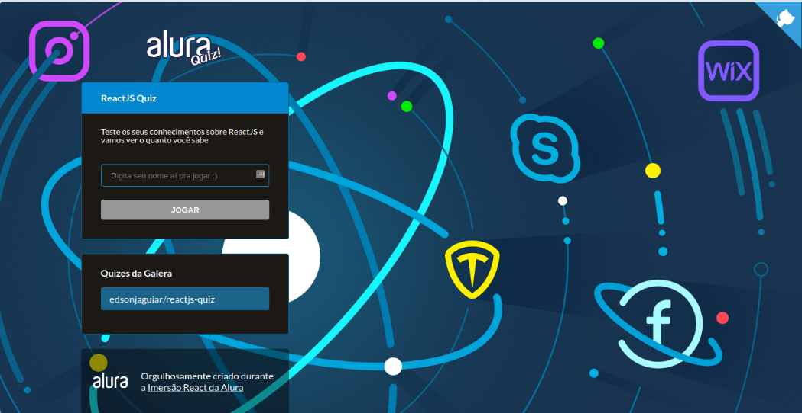

<h1>
    
</h1>

<h1>
    
</h1>

### 🧾 Sobre

<p>Esse projeto foi desenvolvido durante a imersão React, da <a href="https://www.alura.com.br/" title="Alura Cursos" target="_blank">Alura</a>. O projeto é um Quiz, com várias perguntas sobre determinado assunto, e o usuário tem que acertar o máximo de perguntas que conseguir.</p>

---

### 🚀 Tecnologias utilizadas

- React
- Next
- Styled-components
- Eslint

---

### 〽️ Getting started

```zsh
    # Clonando o repositório em sua máquina
    $ git clone https://github.com/edsonjaguiar/reactjs-quiz

    # Acessando o repositório
    $ cd reactjs-quiz

    # Instalando as dependências
    $ yarn

    # Iniciando o server
    $ yarn dev
```
